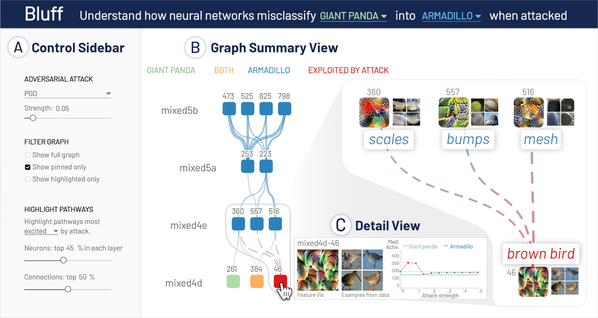

# Bluff

Bluff is an interactive system for deciphering adversarial attacks on Deep Neural Networks (DNNs). 

- **Live demo:** [https://poloclub.github.io/bluff/][demo]
- **Code and Data:** [https://github.com/poloclub/bluff][src]

**[Bluff: Interactively Deciphering Adversarial Attacks on Deep Neural Networks][demo]** <br />
Nilaksh Das*, Haekyu Park*, Zijie J. Wang, Fred Hohman, Robert Firstman, Emily Rogers, Duen Horng (Polo) Chau <br />
\* Both contributed equally



## Live Demo
For a live demo, visit: [https://poloclub.github.io/bluff/][demo]

## Code and Data
Code (both frontend and backend) and data are available at [https://github.com/poloclub/bluff][src].

## Running Bluff user interface Locally
- Download or clone this repository:
  ```bash
  git clone https://github.com/fredhohman/summit.git
  ```

- Within `bluff` repo, run:
  ```bash
  python -m http.server <PORT>
  ```
  For example,
  ```bash
  python -m http.server 8080
  ```
  To run this command, python 3 is needed.
  
- Open any web browser and go to `http://localhost:<PORT>`. For example, `http://localhost:8080` if you used port 8080.

## Running Bluff backend
This project is written in python 3.7.6. You can install the dependencies by running:
```
pip install -r requirements.txt
```

## License
MIT License. See [`LICENSE.md`](LICENSE.md).


## Contact
For questions contact [Nilaksh Das](http://nilakshdas.com/) or [Haekyu Park](haekyu@github.io).


[demo]: https://poloclub.github.io/bluff/
[src]: https://github.com/poloclub/bluff
